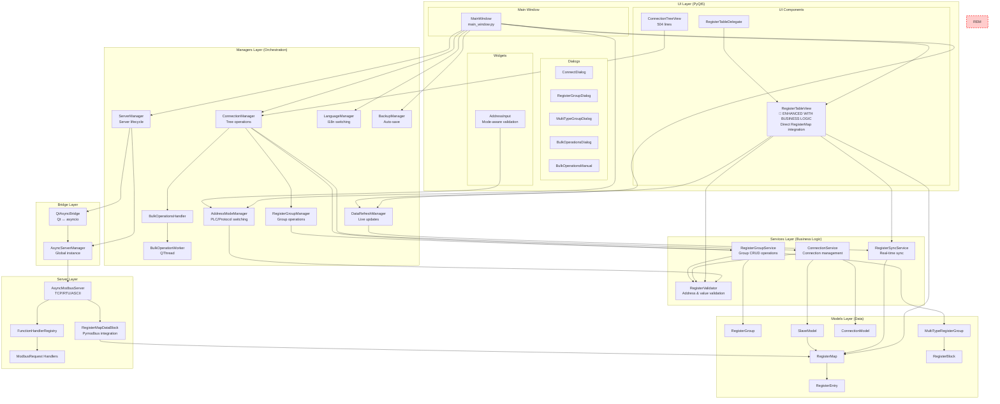
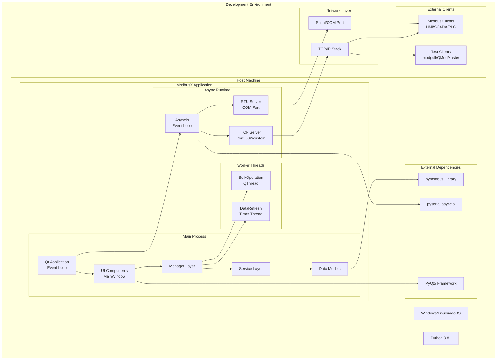
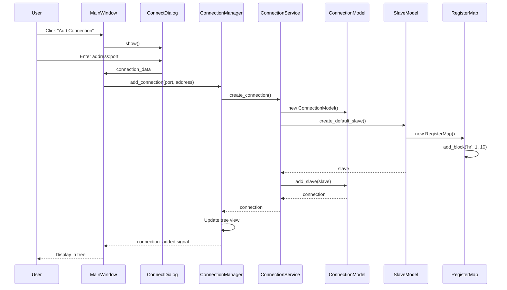
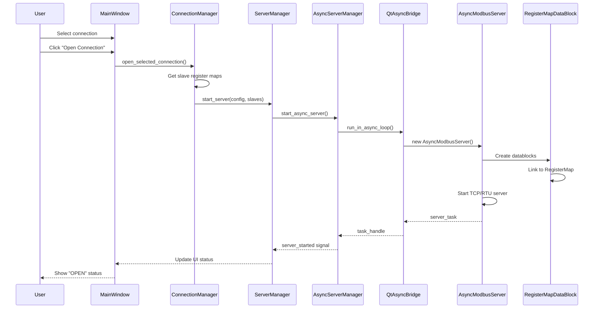
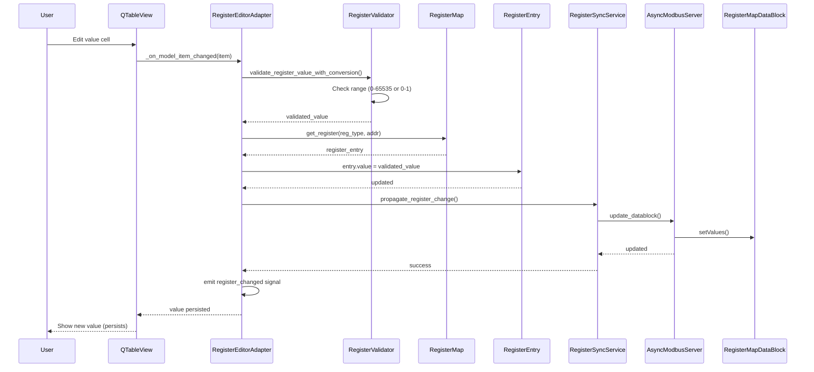
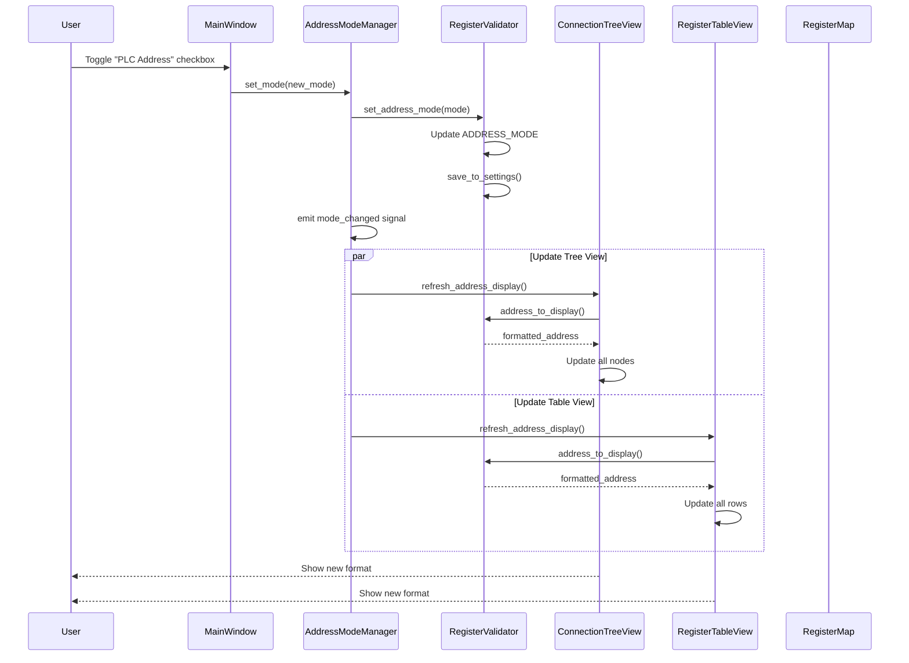
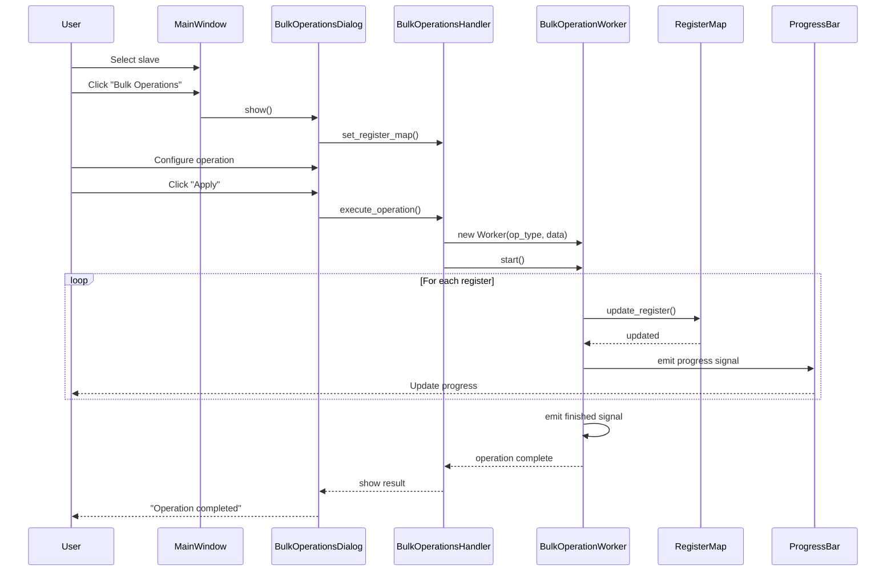
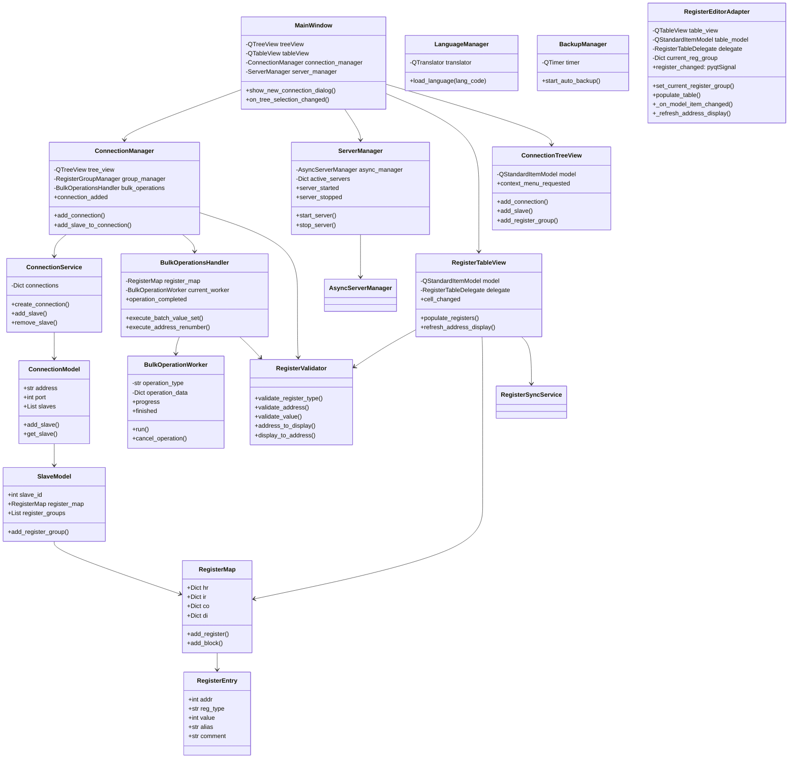
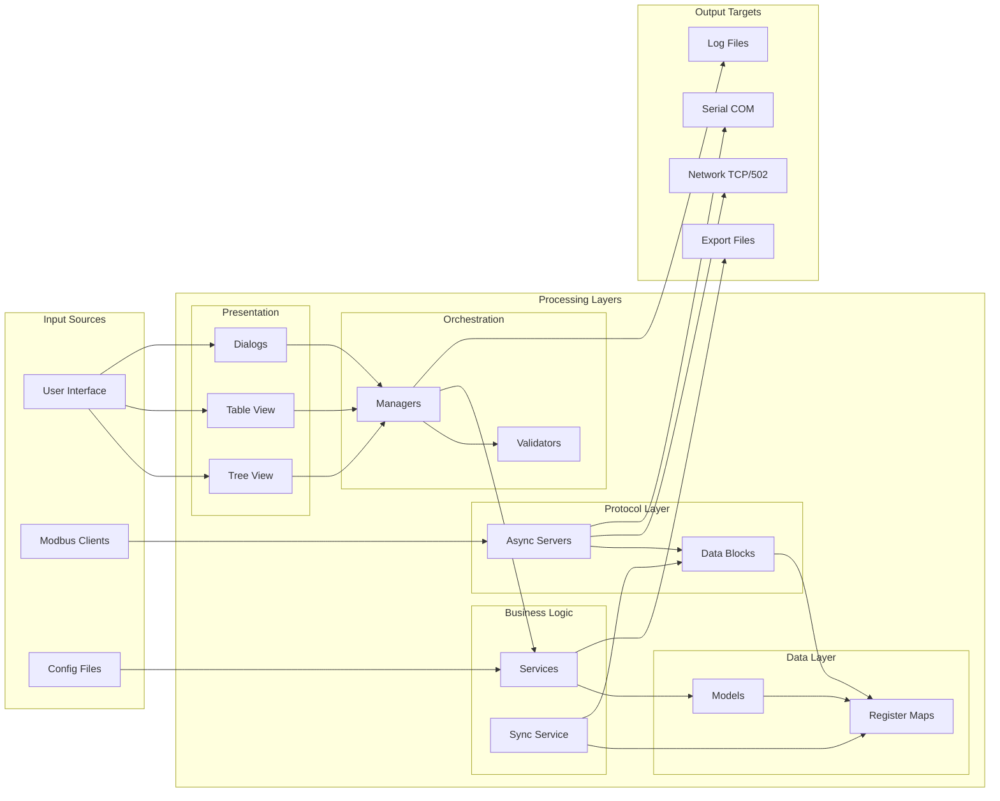

# ModbusX Architecture Diagrams

## 1. Component Diagram (Accurate & Complete)

## 2. Deployment Diagram

## 3. Sequence Diagrams

### 3.1 Connection Creation Workflow

### 3.2 Server Start Workflow

### 3.3 Register Value Update Workflow

### 3.4 Address Mode Switching Workflow

### 3.5 Bulk Operations Workflow

## 4. Class Relationships

## 5. Data Flow Diagram

## Migration Status

### 🎉 **FULL MIGRATION COMPLETED**

#### ✅ **Phase 1**: RegisterEditorManager → RegisterEditorAdapter
- ✅ **DELETED** `register_editor_manager.py` file (379 lines removed)
- ✅ Created compatibility adapter with value persistence
- ✅ **FIXED** layout preservation - connection widget displays correctly
- ✅ **FIXED** register value persistence issue

#### ✅ **Phase 2**: RegisterEditorAdapter → Enhanced RegisterTableView
- ✅ **DELETED** `register_editor_adapter.py` file (180+ lines removed)
- ✅ **ENHANCED** RegisterTableView with integrated business logic
- ✅ **DIRECT** RegisterMap integration and persistence
- ✅ **ELIMINATED** all adapter pattern complexity
- ✅ **MAINTAINED** full backward compatibility
- ✅ **TESTED** table visibility and functionality

### 🏆 Final Architecture State
- ✅ **RegisterEditorManager**: ❌ **DELETED** (Phase 1)
- ✅ **RegisterEditorAdapter**: ❌ **DELETED** (Phase 2)
- ✅ **RegisterTableView**: ✅ **ENHANCED** with full business logic
- ✅ **Clean Architecture**: No adapter patterns, direct component usage
- ✅ **Performance**: Direct method calls, no delegation overhead

### Technical Implementation
- **Enhanced RegisterTableView** handles:
  - ✅ Register group management via `set_current_register_group()`
  - ✅ Business logic via `_on_business_logic_item_changed()`
  - ✅ Value validation via `RegisterValidator`
  - ✅ Direct `RegisterMap` persistence via `entry.value = validated_value`
  - ✅ Real-time sync via `RegisterSyncService`
  - ✅ Address mode switching via `connect_address_mode_signals()`
  - ✅ Error handling and value reversion
  - ✅ All 6 columns (Type, Address, Alias, Value, Comment, Units)

### Files Changed
- ✅ **ENHANCED**: `modbusx/ui/components/register_table_view.py`
- ✅ **UPDATED**: `modbusx/ui/main_window.py` (direct RegisterTableView usage)
- ❌ **DELETED**: `modbusx/managers/register_editor_adapter.py`